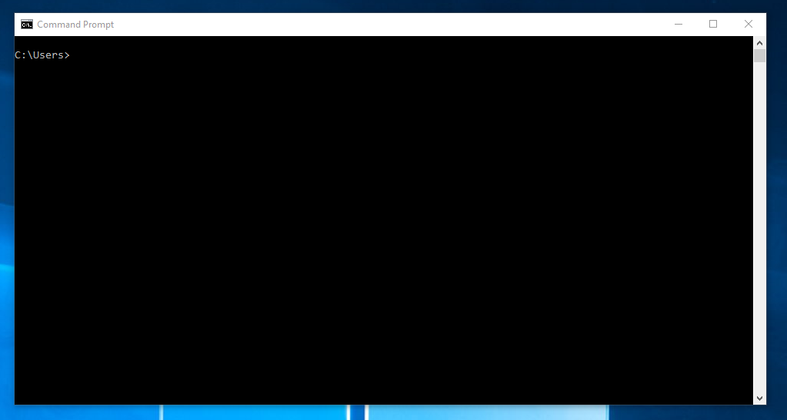
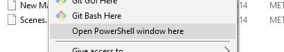
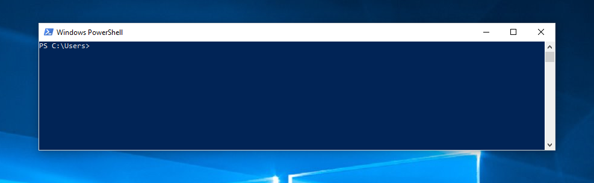
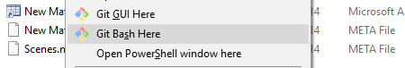
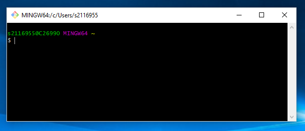

# CT4103 - Week 4 - Task 1

## Command Prompt Tasks
These tasks are designed to test your knowledge from todays slides, feel free to look back at them for reference.

## Opening a terminal
First of all we need a way to actually use these commands...

#### Windows Command Prompt
Once you have installed Git to Windows, you can start using it via the Windows Command Prompt. To open it, you can either:
- Type `cmd` into the Windows start menu search bar
- Hit <kbd>Windows Key</kbd> + <kbd>R</kbd>, to open the *Run Window*. Then type `cmd.exe` and hit *Run*



#

#### Windows Powershell
The Powershell is very similar to the Command Prompt and can be opened in the following ways.
- Type `powershell` into the Windows start menu search bar
- Hit <kbd>Shift</kbd> + <kbd>Right Click</kbd> when in any Windows Explorer window and click *Open Powershell Window here*





#

#### Git Bash
Git Bash is an optional install that you can choose to install when you install Git. You can open it by:
- Type `git bash` into the Windows start menu search bar
- Hit <kbd>Shift</kbd> + <kbd>Right Click</kbd> when in any Windows Explorer window and click *Git Bash here*





## Getting to the right place
Once opened, we need to move to our tutorial repository. You can do this by using the `cd` command, which stands for *Change Directory*. Try and navigate using the `cd` command and get to the tutorial repository.
<details>
    <summary>Solution</summary>

The following command can be used to go directly to a specific folder.
```bash
cd "C:/Users/UserName/Documents/GitHub/"
```
Or you can use a series of commands to get to where you want. 
```bash
cd Users
cd UserName
cd Documents/GitHub
```

</details>


## Making a new folder
Make a new folder within the tutorial repository, call it whatever you want!

<details>
    <summary>Solution</summary>

The following command can be used to create a folder.
```bash
mkdir FolderName
```
</details>

## Create a file
Create a new file, make it any extention that you want

<details>
    <summary>Solution</summary>

The following command can be used to create a file of any filetype.
```bash
touch Hello.txt
```
</details>

## Moving the file
Move the file that you just created, into the folder that you just created.

<details>
    <summary>Solution</summary>

The following command can be used to move a file or folder.
```bash
mv filename.txt MyFolderName
```
</details>

# Make a copy of the folder
Make a copy of the folder so we don't lose it in the next step!

<details>
    <summary>Solution</summary>

The following command can be used to copy a file or folder.
```bash
cp FileOrFolderToCopy WhereToCopyTo
```
</details>

## Deleting the Folder
Delete the folder and the file!

<details>
    <summary>Solution</summary>

The following command can be used to delete a file or folder.
```bash
rm FileOrFolderName
```
</details>
